# Churn Intelligence - Customer Churn Prediction & Business Intelligence System

**Live app:** _add your Streamlit Cloud link here after deploying - see [Deploy](#deploy-to-streamlit-community-cloud)_
&nbsp;·&nbsp; **Windows:** double-click [`run_dashboard.bat`](run_dashboard.bat)

An end-to-end churn system on the IBM Telco dataset (7,043 customers) that answers the question a
retention team actually has: **who should we call this week, why are they leaving, what should we
offer them, and is the campaign worth the money?** SQL data layer -> 5 tuned models -> money-optimal
decision threshold -> SHAP reasons for every customer -> next-best actions -> scenario simulation ->
AI Copilot and LLM-written retention briefs, all in a 9-page Streamlit command center.

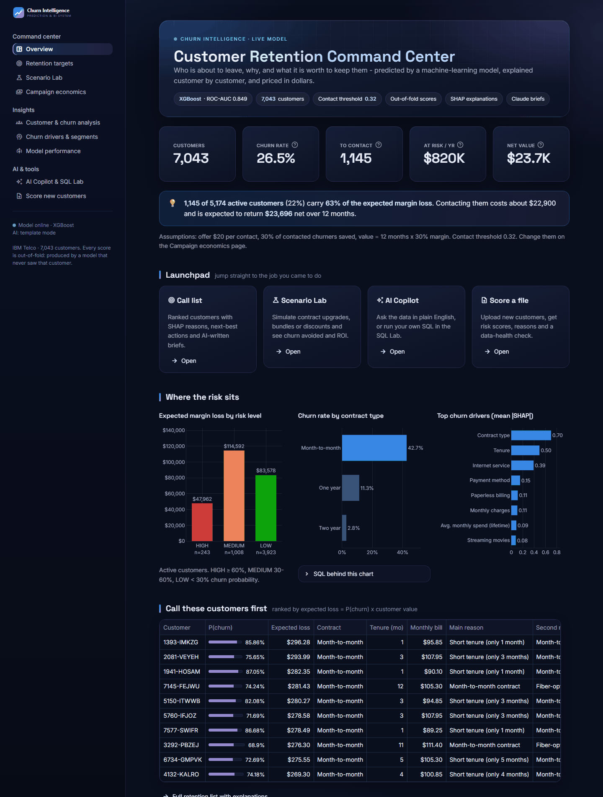

### Features at a glance

| | |
|---|---|
| :dart: **Retention targets** | Active customers ranked by expected loss, each with SHAP reasons in plain English, a risk gauge and a ready-to-send retention brief |
| :bulb: **Next-best action** | Every retention offer tested on the individual customer with the live model: "1-year contract: risk 86% -> 59%, net if accepted ..." |
| :test_tube: **Scenario Lab** | Simulate contract upgrades, security bundles, auto-pay or discounts for any audience: churners avoided, margin retained, cost, ROI - and a head-to-head strategy comparison |
| :moneybag: **Campaign economics** | Change offer cost, save rate, horizon or margin and the contact threshold re-optimises live across the whole app |
| :robot: **AI Copilot** | Ask the data in plain English - Claude writes and runs read-only SQL through tool use and answers with sourced numbers |
| :computer: **SQL Lab** | Query the analytical database yourself: templates, schema explorer, auto-charts, CSV export (sandboxed: read-only, time-limited) |
| :shield: **Data-health check** | Uploaded files are scored *and* checked for drift (PSI per feature) against the training data |
| :bar_chart: **BI & explainability** | SQL-driven segment analysis, SHAP and permutation importance, dependence plots, k-means segments, model diagnostics |

## Results

| | |
|---|---|
| **Best model** | XGBoost - ROC-AUC **0.849**, PR-AUC **0.673** on 1,409 held-out customers (CV 0.848 ± 0.016); the top 10% of scores contain **2.8x** the base churn rate |
| **Threshold chosen with money, not accuracy** | Contacting customers above **0.32** instead of 0.50 reaches **74%** of churners instead of 52% and earns **+$2,054 (+19%)** net value on the held-out set |
| **Per-customer expected-value rule** | Contact when P(churn) x save rate x value > offer cost: **+31%** vs. the 0.50 default |
| **Where the money is** | **1,145 of 5,174** active customers (22%) carry **63%** of the expected margin loss; **$820k** of annual revenue is at risk across the active base |
| **Why customers leave** | Contract type, tenure and internet service dominate (SHAP and permutation importance agree); 20% of all churners leave in month 1 |

Campaign assumptions (all adjustable in the dashboard): a retention offer costs **$20** per contact,
**30%** of contacted churners are saved, and a saved customer is worth **12 months x 30% margin** of
their bill. Held-out figures are for 1,409 test customers; the dashboard also backtests on all
7,043 out-of-fold scores ($66.4k vs. $54.5k net at 0.32 vs. 0.50).

| Retention targets: gauge, SHAP reasons, next-best action, brief | Scenario Lab: price a strategy before spending on it |
|---|---|
| 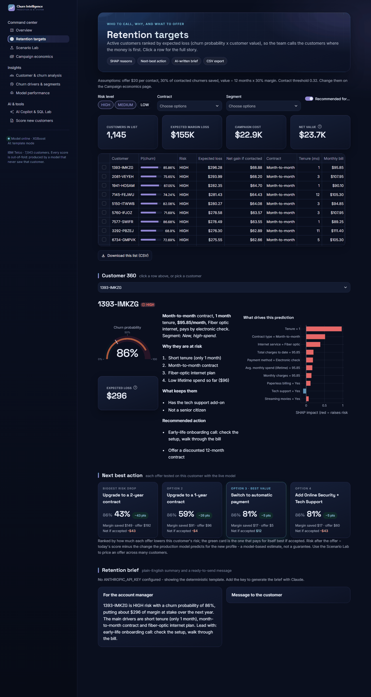 | 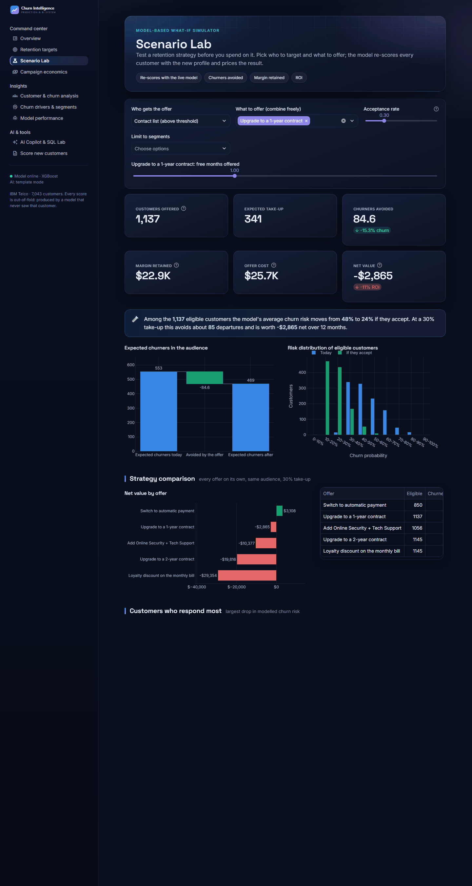 |

| AI Copilot & SQL Lab | Score new customers with a data-health check |
|---|---|
| 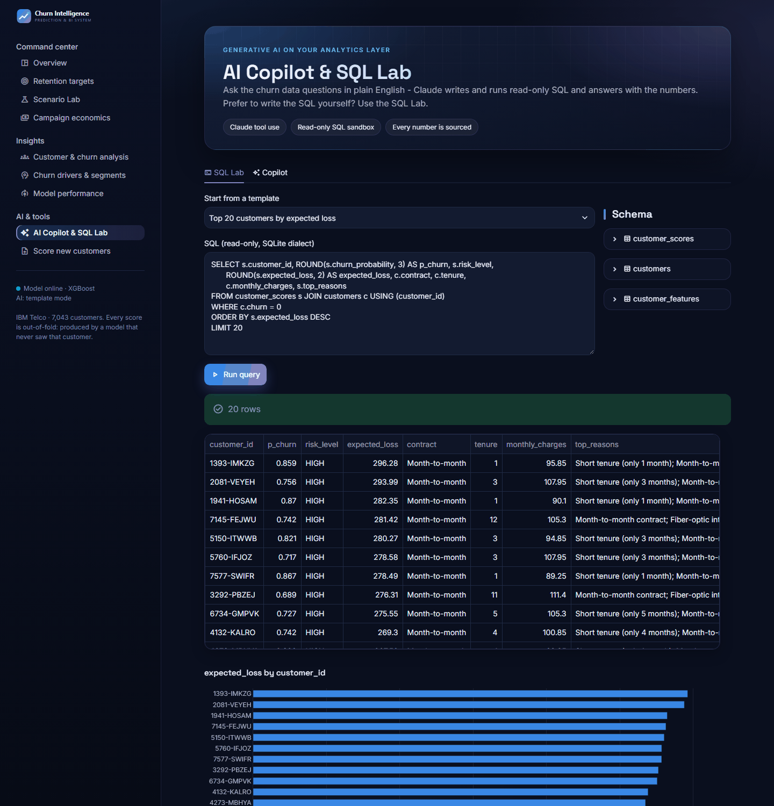 | 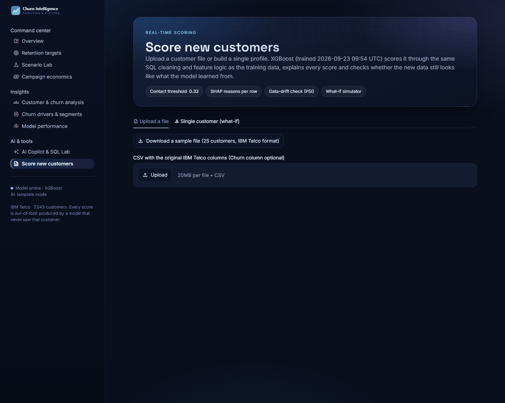 |

<details>
<summary>More dashboard pages</summary>

| Campaign economics | Customer & churn analysis (SQL-driven) |
|---|---|
| 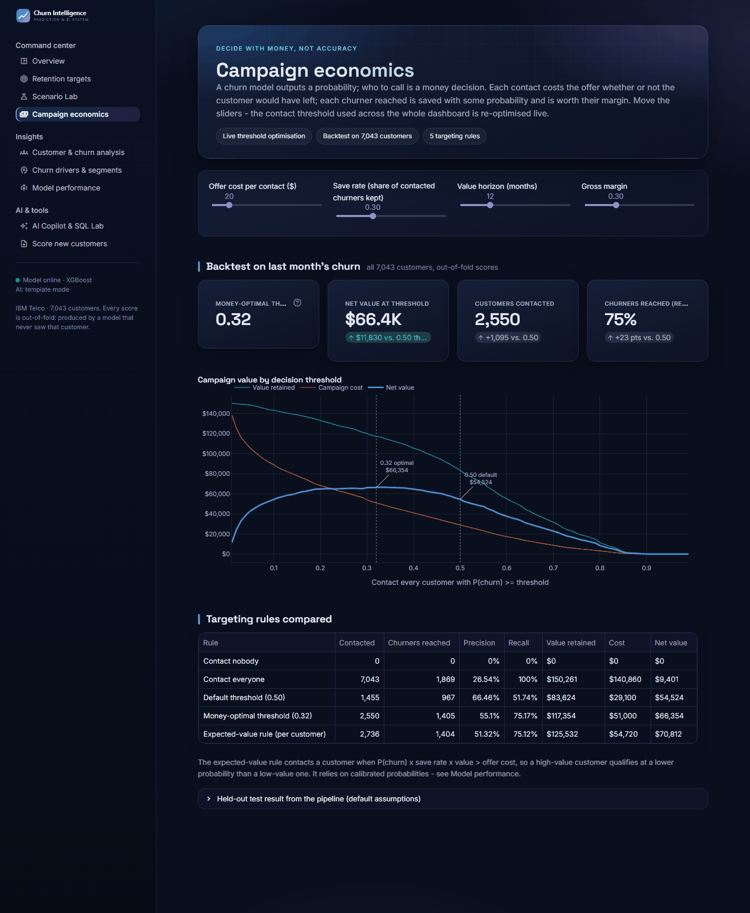 | 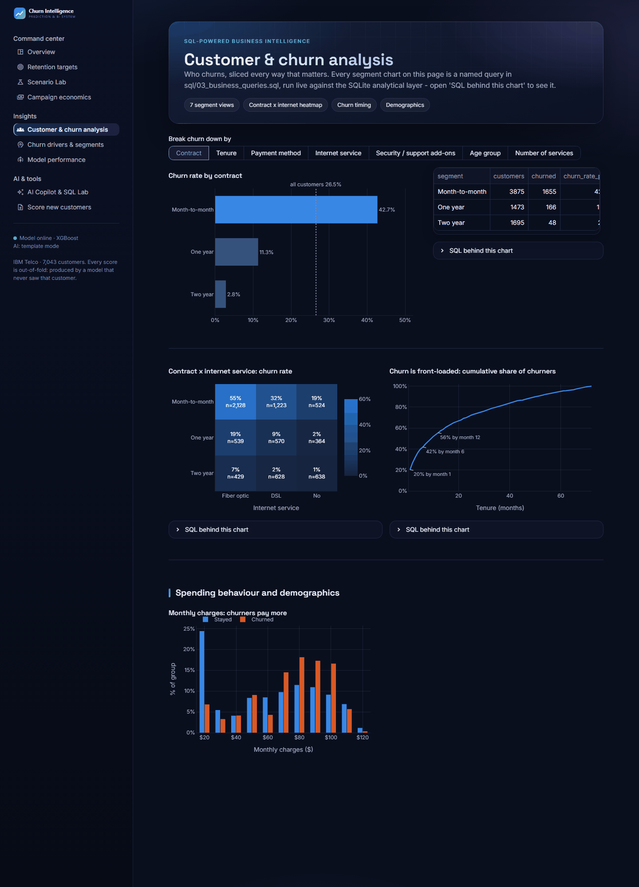 |

| Churn drivers & segments | Model performance |
|---|---|
| 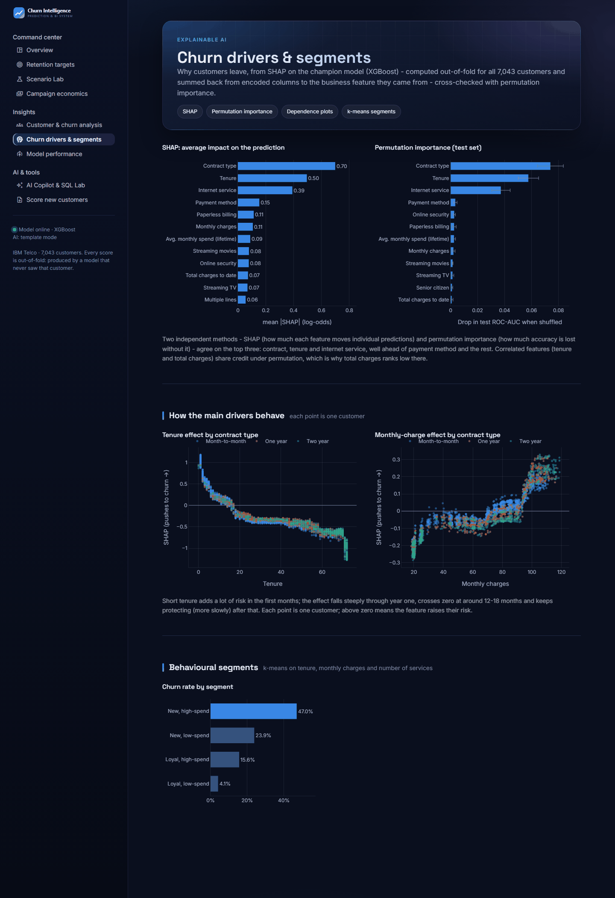 | 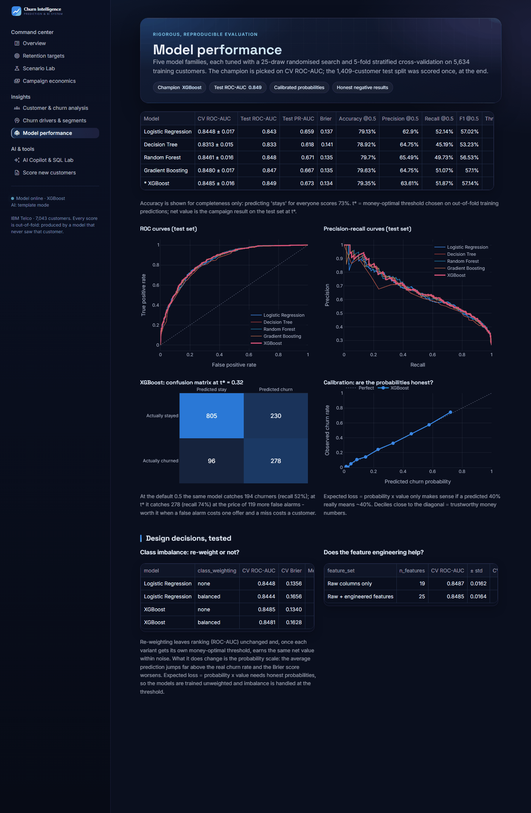 |

</details>

**For non-technical readers:** a 6-page [business report (PDF)](reports/business_report.pdf) with
the findings, the call list and the recommendations.

## What makes it more than a Telco notebook

1. **The threshold is chosen with money.** Every model gets its own threshold, chosen on
   *out-of-fold training predictions* (never the test set) to maximise campaign net value, then applied
   unchanged to the test set. The training and test value curves overlap, so the choice generalises.
2. **Customers are ranked by expected loss** (P(churn) x customer value), not by probability, and
   every one of them carries its **top SHAP reasons in plain English** plus a playbook action.
3. **Every score shown in the dashboard is out-of-fold.** Each customer is scored and explained by a
   model trained without them, so the call list is as honest as the test metrics.
4. **SQL does the data work.** Cleaning, typing, de-duplication, business features, a data-quality
   gate and every segment chart are SQL on SQLite - and the *same* SQL cleans uploaded files at
   scoring time, so training and scoring cannot drift apart.
5. **Classic ML + generative AI.** Claude turns a customer's SHAP reasons into an account-manager
   brief and a customer message, using only the model's facts and approved actions (falls back to a
   deterministic template without an API key).
6. **Negative results are reported, not hidden** - see [Honest findings](#honest-findings).

## Model comparison

5 model families, 25-draw randomised search each, 5-fold stratified CV on the 80% training split.
Champion picked on CV ROC-AUC; the 20% test split was scored once, at the end.

| Model | CV ROC-AUC | Test ROC-AUC | PR-AUC | Accuracy | Precision | Recall | F1 | Brier | t* | Net value @ t* |
|---|---|---|---|---|---|---|---|---|---|---|
| Logistic Regression | 0.8448 ± 0.017 | 0.843 | 0.659 | 0.791 | 0.629 | 0.521 | 0.570 | 0.137 | 0.28 | $12,992 |
| Decision Tree | 0.8313 ± 0.015 | 0.833 | 0.618 | 0.789 | 0.648 | 0.452 | 0.532 | 0.141 | 0.27 | $12,532 |
| Random Forest | 0.8461 ± 0.016 | 0.848 | 0.671 | 0.797 | 0.655 | 0.497 | 0.565 | 0.135 | 0.32 | $12,763 |
| Gradient Boosting | 0.8480 ± 0.017 | 0.847 | 0.667 | 0.796 | 0.647 | 0.511 | 0.571 | 0.135 | 0.32 | $12,777 |
| **XGBoost** | **0.8485 ± 0.016** | **0.849** | **0.673** | 0.793 | 0.636 | 0.519 | 0.571 | **0.134** | 0.32 | $12,736 |

Accuracy, precision, recall and F1 at the default 0.5 threshold; t* = money-optimal threshold;
net value = campaign result on the test set at t*. Predicting "stays" for everyone would score 73.5% accuracy.

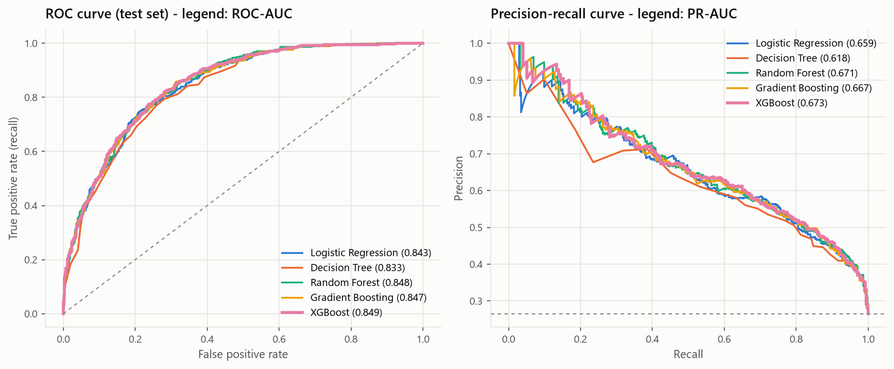

## Choosing the threshold with money

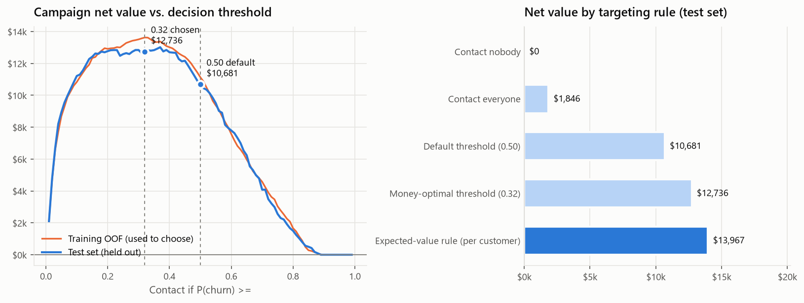

| Rule (1,409 test customers, 374 churners) | Contacted | Churners reached | Net value |
|---|---|---|---|
| Contact nobody | 0 | 0 | $0 |
| Contact everyone | 1,409 | 374 | $1,846 |
| Default threshold 0.50 | 305 | 194 | $10,681 |
| **Money-optimal threshold 0.32** | 508 | 278 | **$12,736** |
| Expected-value rule (per customer) | 535 | 277 | $13,967 |

The optimum is a broad plateau (roughly 0.2-0.45): the lesson is less "0.32 exactly" than "never
default to 0.5 when a missed churner costs far more than a wasted offer".

## Explaining predictions

| Global drivers (mean \|SHAP\|, all customers) | One customer |
|---|---|
| 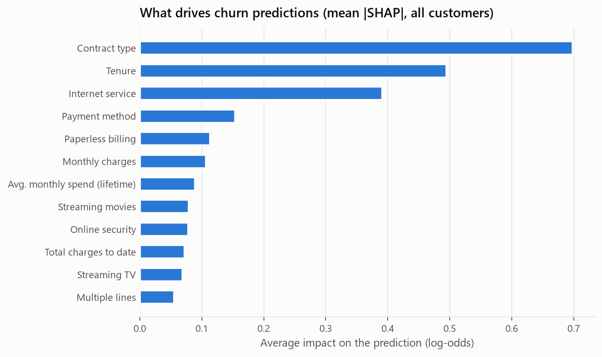 | 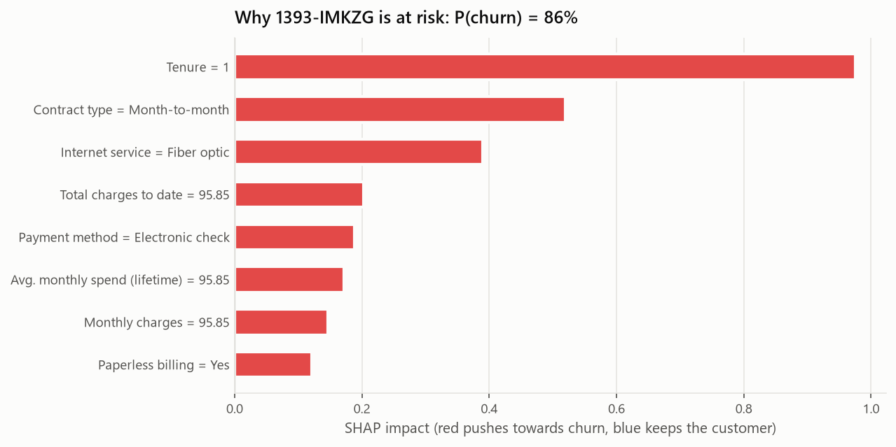 |

SHAP values are computed per encoded column and **summed back to the business feature** (all
`contract_*` columns become "contract type"), then phrased for humans. Example output for the
highest-loss active customer:

```text
Customer ID: 1393-IMKZG
Churn Probability: 85.9%        Risk Level: HIGH        Expected margin loss (12 months): $296

Major Risk Factors:
1. Short tenure (only 1 month)
2. Month-to-month contract
3. Fiber-optic internet plan

Recommended Action:
Early-life onboarding call: check the setup, walk through the bill
Offer a discounted 12-month contract
```

### LLM retention briefs

`src/llm.py` sends Claude **only** the structured facts - probability, risk level, SHAP reasons,
protective factors and the approved playbook actions - and asks for (1) a 2-3 sentence brief for the
account manager and (2) a short customer message that offers only approved actions and never mentions
churn scores. Output is schema-validated (Pydantic structured output); on a missing key, API error or
refusal the dashboard falls back to a deterministic template, so a fresh clone always works.

## Business questions answered

| Question | Answer |
|---|---|
| Which customers are likely to leave? | 1,145 active customers above the money-optimal threshold; 243 of them HIGH risk (>= 60%) |
| What factors contribute? | Month-to-month contract (43% churn vs. 3% on two-year), tenure under a year, fiber internet (42%), no security/support add-ons (49% vs. 9% with both), electronic-check payment (45%) |
| Which segments churn most? | Month-to-month + fiber: **55%**. Behavioural segment "New, high-spend": 47% churn, 34% of customers, **52%** of the expected loss |
| Financial impact? | Churners took 30.5% of monthly revenue last month; $820k of annual revenue is at risk across active customers |
| Who first? | The ranked call list (dashboard -> Retention targets), ordered by expected loss, each with reasons and an action |

## Honest findings

- **The top four models are within 0.004 ROC-AUC** - a quarter of one CV standard deviation.
  XGBoost won on the pre-registered criterion, but a regularised logistic regression would be a
  perfectly defensible, simpler production choice (it even had the highest test net value, within noise).
- **Feature engineering did not improve accuracy.** CV ROC-AUC is 0.8487 with raw columns and 0.8485
  with the engineered features. Depth-2 boosted trees already learn "spend per month" or "price per
  service" from the raw columns. The features stay in the SQL layer for BI and readable explanations.
- **Class re-weighting buys nothing here.** With each variant given its own money-optimal threshold,
  net value is the same within noise - but re-weighting inflates the average predicted churn from
  26.5% to 41% and worsens the Brier score (0.134 -> 0.163). Expected loss needs honest probabilities,
  so imbalance is handled at the threshold. The unweighted model is well calibrated.
- **The dataset has limits.** There are no support-call, usage-history or payment-delay columns, so
  those features from the original brief were not fabricated; "current bill vs. lifetime average"
  is the closest honest proxy for a usage trend. The IBM data is a single snapshot, so "active
  customers" are those who had not churned by the extract date.
- **Most retention offers don't pay for themselves at default assumptions** (Scenario Lab, contact
  list of 1,145 customers, 30% take-up, 12-month margin value). Contract upgrades cut modelled risk
  the most (48% -> 24% for 1-year, 48% -> 14% for 2-year) but, paid for with one or two free months,
  cost as much or more than they save (-$2.9K / -$19.8K net). Moving check payers to automatic
  payment is the only offer that clears its cost (+$3.1K), and a 10% discount barely moves risk
  (48% -> 47%, -$29.4K): the model sees contract and payment behaviour, not price, as the lever.
  These are model-based (correlational) estimates - the kind of result to confirm with an A/B test.
- **The data-quality gate caught something.** A check flagged two customers whose total charges
  were 1.5x tenure x current bill. Both had 2-3 months of tenure, so one plan change explains it;
  they are real accounts and the check now allows one month of slack instead of dropping rows.

## How it works

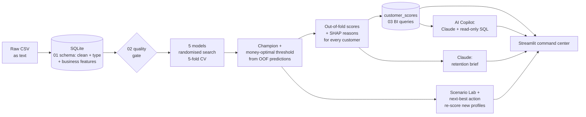

```text
├── data/raw/Telco-Customer-Churn.csv     IBM sample data (input)
├── data/processed/                       features + scored customers (pipeline output)
├── sql/
│   ├── 01_create_schema.sql              cleaning, typing, de-dup, business features
│   ├── 02_data_quality_checks.sql        gate: pipeline fails on any violation
│   └── 03_business_queries.sql           named BI queries (dashboard + notebooks)
├── src/
│   ├── config.py                         paths, features, campaign economics
│   ├── data_preprocessing.py             CSV -> SQLite, checks, same SQL for uploads
│   ├── feature_engineering.py            fitted preprocessing, SHAP column grouping
│   ├── train_model.py                    tuning, comparison, imbalance + ablation experiments
│   ├── evaluate_model.py                 metrics
│   ├── economics.py                      campaign value, threshold, expected loss
│   ├── explain.py                        SHAP -> plain-English reasons -> playbook actions
│   ├── segmentation.py                   k-means behavioural segments
│   ├── llm.py                            Claude retention briefs + template fallback
│   ├── scenarios.py                      Scenario Lab + next-best action (re-scores new profiles)
│   ├── copilot.py                        AI Copilot: Claude tool-use loop over read-only SQL
│   ├── sql_lab.py                        sandboxed SQL: read-only, authorizer, time + row limits
│   ├── monitoring.py                     data-drift check (PSI) for uploaded files
│   ├── predict.py                        scoring (python -m src.predict --input file.csv)
│   ├── visualization.py                  report figures
│   ├── report.py                         business_report.pdf (python -m src.report)
│   └── pipeline.py                       runs everything end to end
├── notebooks/01-04                       cleaning, EDA + stats tests, features, modelling
├── dashboard/app.py, theme.py, views/    9-page Streamlit command center (dark, glass UI)
├── models/churn_model.pkl                champion pipeline + threshold + explainer data
├── reports/                              business_report.pdf, metrics JSON, figures, tables
├── run_dashboard.bat / run_pipeline.bat / run_tests.bat    one-click Windows launchers
└── tests/                                42 pytest tests: economics, SQL layer, scenarios, drift,
                                          SQL sandbox attacks, Copilot loop (offline), explanations
```

## Run it locally

**Windows, one click:** double-click **`run_dashboard.bat`**. The first run creates a virtual
environment and installs the requirements (a few minutes); after that the dashboard opens in your
browser in seconds. `run_pipeline.bat` retrains everything and `run_tests.bat` runs the test suite.

**Any OS, manually:**

```bash
python -m venv venv
venv\Scripts\activate            # macOS/Linux: source venv/bin/activate
pip install -r requirements-dev.txt
python -m src.pipeline           # ~12 min on a 4-core laptop; --no-llm skips Claude
streamlit run dashboard/app.py
pytest
```

The repository ships with the trained model and scored data, so `streamlit run dashboard/app.py`
works straight after `pip install -r requirements.txt` - the pipeline is only needed to retrain.
Score a new file from the command line:

```bash
python -m src.predict --input new_customers.csv --output scored.csv
```

Optional - AI features (Claude briefs and the Copilot): set `ANTHROPIC_API_KEY` in your
environment, or copy `.streamlit/secrets.toml.example` to `.streamlit/secrets.toml` (git-ignored).
Without a key everything else works: briefs come from a deterministic template and the SQL Lab
replaces the Copilot. The Copilot's tool loop is covered by offline tests with a scripted client;
`python -m src.pipeline --briefs-only` regenerates the example briefs once a key is set.

## Deploy to Streamlit Community Cloud

1. Push this repository to GitHub (the model, scored CSV and figures are committed on purpose).
2. On [share.streamlit.io](https://share.streamlit.io) -> **Create app** -> pick the repo, branch
   `main`, main file **`dashboard/app.py`**, and Python **3.11** under *Advanced settings*.
3. Optional: under *Secrets* add `ANTHROPIC_API_KEY = "sk-ant-..."` to enable the Claude briefs
   and the AI Copilot.
4. Paste the app URL at the top of this README.

`requirements.txt` pins exact versions because `models/churn_model.pkl` must be loaded by the same
scikit-learn and XGBoost versions it was trained with.

## Tech stack

Python 3.11 · SQL (SQLite) · pandas · NumPy · SciPy · scikit-learn · XGBoost · SHAP · Matplotlib ·
Plotly · Streamlit · Anthropic Claude API · pytest. The scored customer table
(`data/processed/customers_scored.csv`, or the `customer_scores` table in `data/churn.db`) can be
connected directly to Power BI or any other BI tool.

## CV summary

**Customer Churn Prediction & Business Intelligence System** - Python, SQL, scikit-learn, XGBoost, SHAP, Streamlit, Claude API
- Built an end-to-end churn system on 7,043 telecom customers: SQL cleaning layer with an automated
  data-quality gate, 5 tuned models (XGBoost champion, ROC-AUC 0.85), SHAP explanations and a
  9-page Streamlit command center with a scenario simulator, drift monitoring and an AI Copilot
  (Claude tool use over a sandboxed, read-only SQL layer).
- Chose the decision threshold by campaign economics instead of accuracy, increasing retention-campaign
  net value by 19% on held-out data (31% with a per-customer expected-value rule) and reaching 74% of
  churners instead of 52%.
- Ranked customers by expected revenue loss with plain-English SHAP reasons, identifying 22% of active
  customers who carry 63% of expected loss, and used an LLM (Claude) to turn each customer's risk
  factors into a retention brief.
- Built a model-based what-if simulator that prices retention offers before launch, showing that
  only auto-pay migration clears its cost at default assumptions while discounts barely move risk.

## Data

IBM Telco Customer Churn sample dataset (7,043 customers, 21 columns), as published by IBM for
Cognos Analytics / Watson demos and widely mirrored (e.g. Kaggle "blastchar/telco-customer-churn").
